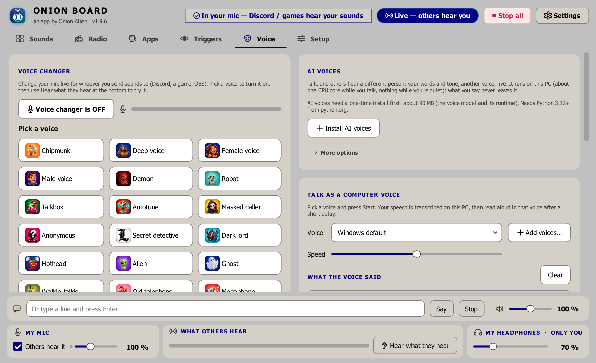
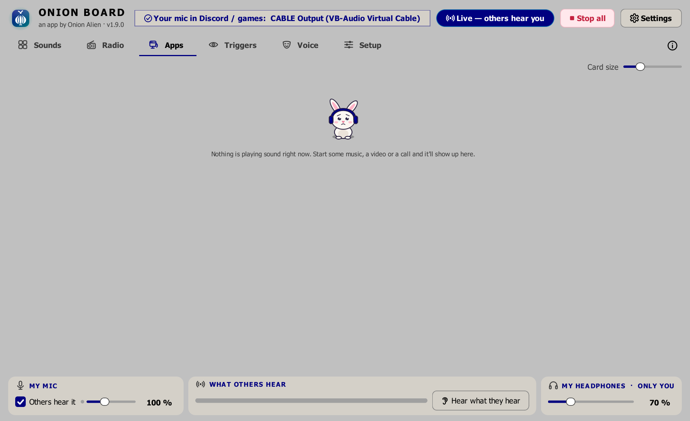
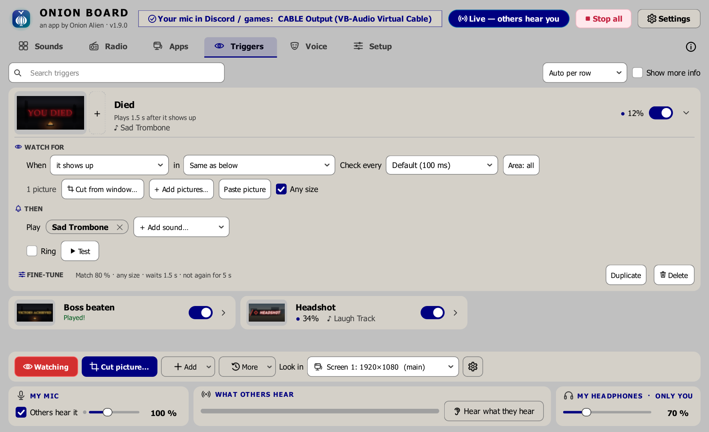
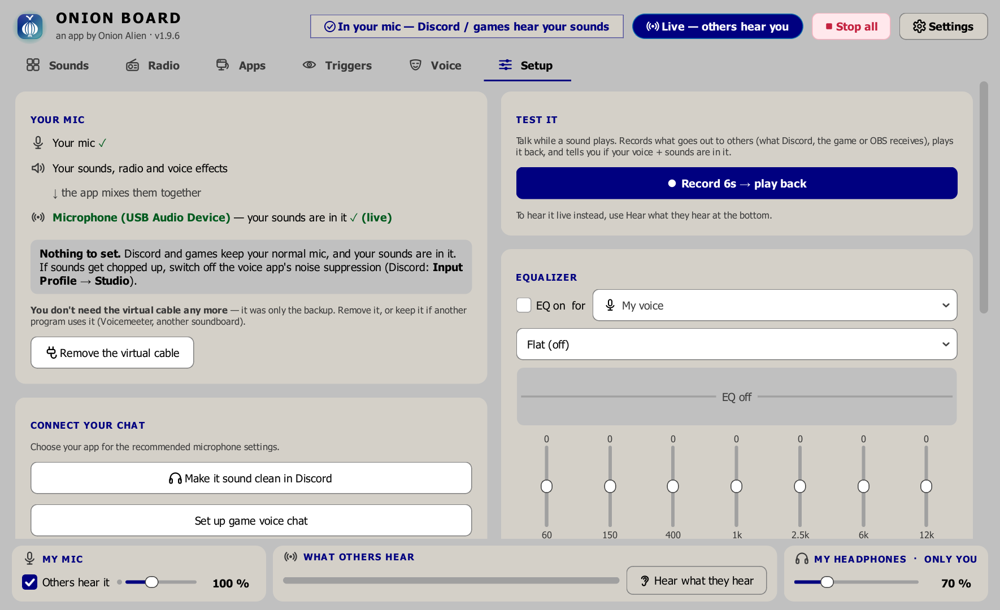
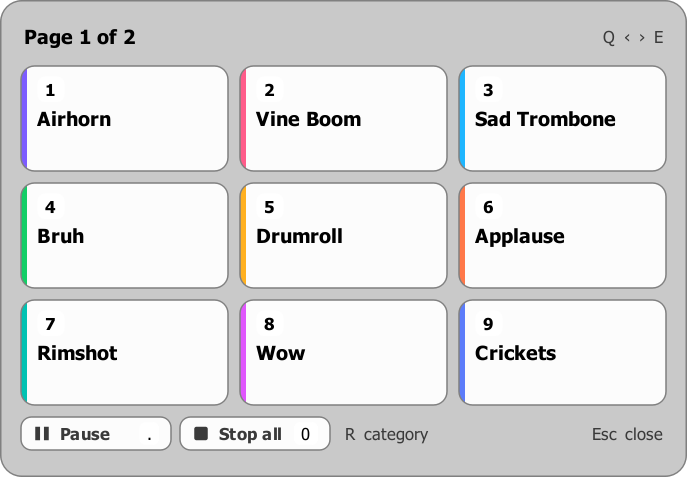
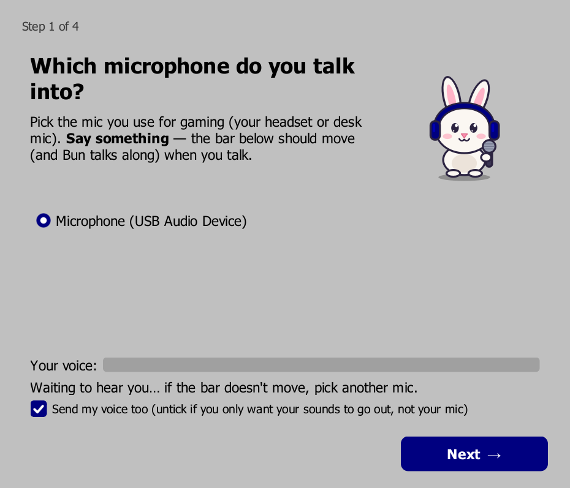
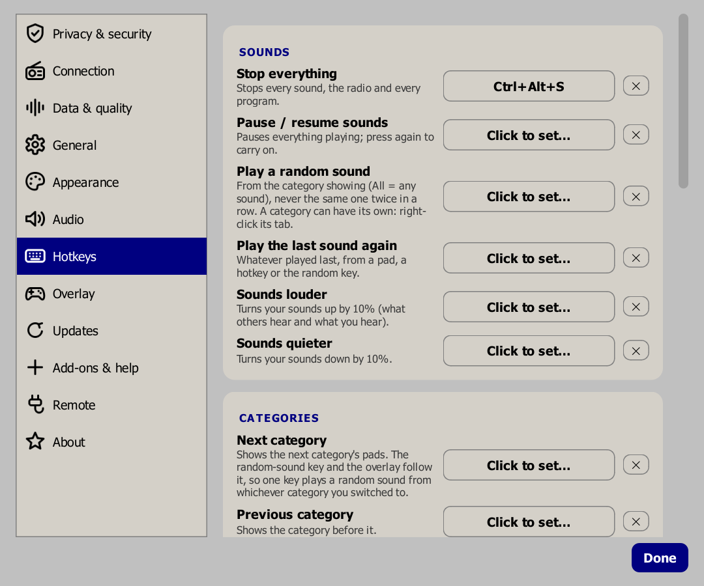

# Onion Board

A free soundboard for Windows gamers. Press a button (or a hotkey, even in-game)
and **your friends in Discord or your game hear the sound** through your mic. Your
voice goes along with it, or switch that off and send **only the sounds**.

## ⬇️ [Download Onion Board for Windows](../../releases/latest/download/OnionBoardSetup.exe)

One file, `OnionBoardSetup.exe`. Download it, double-click it, done.
Windows 10 or 11.

> **Windows or your browser may warn you. That's normal for a free app that isn't
> from a big company** (the installer isn't "code-signed", which costs hundreds a
> year). It's safe to carry on:
> - **Edge / Chrome** says it's *"not commonly downloaded"*: click the **⋯** next
>   to the download → **Keep** (Edge: then **Show more → Keep anyway**).
> - **Blue "Windows protected your PC" box**: click **More info → Run anyway**.
>
> The source code is all here if you'd rather check it or build it yourself. The latest installer's
> [VirusTotal scan](https://www.virustotal.com/gui/file/4267e4cf1ebdff01fcfacfea926fb13a1d88fdb82cce048f473b8155d8560ac6): none of the 68 virus
> scanners that checked it found anything.

<sub>Other downloads: [all versions](../../releases) ·
[source code (zip)](../../archive/refs/heads/main.zip), only if you want to build
it yourself.</sub>

Version: **1.6.5**. See [CHANGELOG.md](CHANGELOG.md).


<details>
<summary><b>More screenshots</b></summary>

**Voice**: change your voice live, or type / talk and a computer voice says it.


**Apps**: send one program's sound (music, a video, a browser tab) to your friends.


**Triggers**: plays a sound when something shows up in your game, like "YOU DIED", even
while other windows cover it. It's the free [Onion Watch](https://onion-alien.github.io/onion-watch/)
add-on, one click away on the tab (Onion Watch is also its own app).


**Setup**: shows at a glance whether others can hear you, plus devices, *Who's listening*
(the voice chat on the other end — Discord, Vivox, Epic Online Services, Steam voice,
Unity voice or low-bandwidth game voice: your sounds are shaped to survive it, and the
picker suggests the right one for the game you're playing when it can tell) and an
equalizer.


**In-game overlay**: press a key in your game, then a number to play a sound.


**First start**: Bun the bunny walks you through four quick questions.


**Hotkeys**: work while you're in a game.


</details>

---

## Get started (no computer skills needed)

**1. [Download `OnionBoardSetup.exe`](../../releases/latest/download/OnionBoardSetup.exe).**

**2. Double-click it.** If Windows shows a blue *"Windows protected your PC"*
box, click **More info → Run anyway**. That appears for most small programs that
aren't from a big company.

**3. Pick what you want.** The installer shows a list of tick boxes. If you're not
sure, leave them as they are and click **Install**.

| Box | What it's for | Ticked already? |
|---|---|---|
| **The free virtual cable** | The part that lets Discord and games hear your sounds. You need it. | ✅ yes |
| **Play M4A, AAC and video files** | Lets you add `.m4a` files and videos as sounds. Only shown if your PC doesn't have it yet. | ✅ yes |
| **Set up live voice-to-speech now** | You talk, and everyone hears a computer voice say your words instead. Needs [Python](https://www.python.org/downloads/) installed first, and a 300 MB download. You can also set it up later from the *Voice* tab. | no |
| **Desktop shortcut** | An icon on your Desktop. | ✅ yes |

**4. Click Yes** when Windows asks for permission. That's the virtual cable
being installed.

**5. Answer Bun's four questions.** Onion Board opens with a short guide hosted by
Bun the bunny 🐰:
- *Which mic do you talk into?* Pick yours and say something. The bar should move.
  There's a **Send my voice too** box here. Untick it if you only want your sounds
  to go out.
- *Where do you listen?* Pick your headphones and play the test sound.
- *The virtual cable* is checked (and installed if it's missing).
- *Tell Discord or your game* which mic to use.

**6. Change one setting in Discord or your game.** Set your **microphone / input
device** to **`CABLE Output`**. In Discord that's *User Settings → Voice & Video →
Input Device*. If a game has no mic setting, the Setup tab's *"Game has no
microphone setting?"* button shows you how to make it Windows' default mic.

**7. Add sounds and play.** Drag sound files onto the window (or click **Add sounds**),
then double-click a pad to play it (a single click just selects it). Right-click a pad to give it a hotkey that works in-game, or
**Effects…** to make a sped-up, slowed, pitched or ear-rape version of it.

Looking for a sound you don't have? Type it into **Search sounds** and press
Enter: YouTube results show up in place of your pads (the **YouTube** /
**SoundCloud** buttons above them switch sites). **Play** plays one once through
your mic without keeping it; **Add** makes it a pad. Got a link instead? Paste it
into the same box (YouTube, SoundCloud, TikTok, Instagram, X, Reddit, a direct
link to an audio or video file — most media sites, via
[yt-dlp](https://github.com/yt-dlp/yt-dlp)) and you get **Add as sound** (or press
Enter) and **Play once**.

### Your voice, or just the sounds?

Next to **My mic** at the bottom of the window there's a **send** box:

- **Ticked** (normal): others hear **your voice and your sounds** together. Your
  mic works like it always did, plus sounds.
- **Unticked** (sounds only): others hear **only the sounds**, never your mic.
  Handy if you talk through a different app, or just want to be the DJ.

The same switch is in **⚙ Settings → Audio → Your mic** and in the setup guide.

### Something's not right?

- **Friends can't hear anything:** check Discord or the game uses
  **`CABLE Output`** as its mic, and that Onion Board's *"Your mic in Discord /
  games"* pill is green.
- **Using Voicemeeter, a mixer or OBS instead of the cable?** Setup → Devices →
  *Send to others through* → **Another device**, then pick it under *Send to*.
- **They hear sounds but not you:** tick **send** next to *My mic*.
- **Check it yourself:** the *Setup* tab's **Record 6s → play back** records
  exactly what others get and tells you whether your voice and sounds are in it.
- **An `.m4a` or video won't add:** run the installer again and tick *Play M4A,
  AAC and video files*.
- **Something else:** the log is `%APPDATA%\OnionBoard\onionboard.log`. Attach it
  to a [bug report](../../issues/new/choose) (it contains your device names and
  file paths, so skim it first).
- **Start the guide again:** *Setup* tab → *Step-by-step guide*.

Your sounds and settings are kept in `%APPDATA%\OnionBoard\` and survive
reinstalling or uninstalling. Uninstalling asks whether to remove the virtual cable
too (say No if another program, like Voicemeeter, uses it).

---

## What it can do

- **Pads:** add by button, drag-and-drop (files or folders), or by dropping files into
  the sounds folder (**Sounds folder** opens it; they join the board by themselves). Plays mp3, wav, ogg,
  flac, m4a and more, and pulls the audio out of video files. Search, reorder,
  resize, set colours.
- **Categories:** the tabs above the pads (the *+* after the last tab makes one). Right-click a
  pad → *Categories* to put it in any number of them; right-click a category to
  rename, export or delete it. The in-game overlay shows the same category, and
  its **R** key (numpad **\***) switches to the next one. Right-click a category to
  give it a random-sound hotkey, or to *Play them all* (in order or shuffled). With
  *Sound hotkeys only work in the category showing* (Settings → Hotkeys) each
  category is its own set of keys: one key, a different sound per category.
- **Remove can be undone:** *Removed “…” · Undo* stays up for 10 seconds, and the
  audio file then goes to the Recycle Bin rather than being deleted outright.
- **Backup / share (*Backup* button, or Settings → General):** *Export everything*
  writes every sound (picture, effects, hotkey, categories) and your settings to
  one `.zip`; import it on a new PC. A category or a single pad exports as a sound
  pack to share; importing skips sounds you already have. The format is a plain
  zip of JSON and the original audio files — see
  [docs/BACKUP-FORMAT.md](docs/BACKUP-FORMAT.md).
- **Per sound:** global hotkey (works in-game) or MIDI pad, volume, loop, what
  pressing again does (restart / overlap / toggle), **Solo** (stops every other
  sound first), **Queue** (waits for the sounds playing to finish; right-click any
  pad → *Play next* does it once), **Only others hear it** (not in your
  headphones), a **wait** before it plays, a **cooldown** against spamming and
  **Hold to play** (plays only while you hold its key or pad down, like an air horn).
- **Effects on any sound** (right-click a pad → **Effects…**, or the *Effects* tab
  of **Edit…**): speed and pitch (separately, or together like a record player
  with *Tape mode*), **trim** (drag the start and end on the sound's waveform, or
  type exact times — keep one line out of a 4-minute video), a 7-band EQ, a boost
  up to +36 dB that clips on purpose,
  play backwards, and every voice effect (echo, reverb, distortion, radio, robot,
  add-on effects too). One-click presets: **Ear rape**, Bass boosted,
  Slowed + reverb, Nightcore, Chipmunk, Demon, Fast / Slow-mo (same pitch), Old
  radio, Reversed. *Preview* plays it to you only; **Save** changes that pad,
  **Save as new sound** keeps the original and adds the edited version as its own
  pad. Pads with effects show **FX**; *Reset* goes back to the original. The
  original file is never changed.
- **Your mic on or off:** send your voice with the sounds, or sounds only.
- **No virtual cable? Send it anywhere** (Setup → Devices → *Send to others
  through*): the virtual cable (the default), **another device** (Voicemeeter, a
  mixer, a capture card, any output OBS captures as an *Audio Output Capture*) or
  **nowhere** (only you hear your sounds, and the stream output if you set one).
  With another device the app never puts the cable back, never asks you to
  install it, and shows green once it's sending.
- **Stream output for OBS** (Settings → Audio → *Stream output*): what others hear,
  without the voice chat shaping, on a device of its own (a second virtual cable such
  as VB-Cable A+B, or any output you don't listen on). In OBS add it as an *Audio
  Output Capture* (or, for a cable, *Audio Input Capture* of its Output end) and your
  sounds and screen triggers are their own track, with their own volume. Your voice
  goes with them unless you untick it.
- **Transport bar:** play/pause, stop, a seek slider, and **speed & pitch while
  it plays** (the `1x` button: 0.25×–2×, ±12 semitones, keep the pitch or not).
  That's for listening and isn't saved; use Effects to keep a version.
- **Any window size:** shrink it down to 300 × 300 and it stays usable. Less
  important controls tuck away as it gets smaller and come back when it grows.
- **Global hotkeys** (set in **⚙ Settings → Hotkeys**, the overlay key in
  **⚙ Settings → Overlay**; all work in-game):
  - Stop all, and pause/resume all.
  - A random sound (from the category showing), the last sound again, next /
    previous category (beeps tell you which), sounds louder / quieter, your mic on /
    off, the voice changer on / off or only while a key is held, and **all hotkeys
    off / on** for when you need to type.
  - **In-game overlay** (by default the key left of <kbd>1</kbd>: <kbd>`</kbd> on a
    US keyboard; where that key types a letter, like ö or ñ, it's Alt + that key):
    a small panel of your sounds over the game. Number keys play them, and the game keeps your mouse
    and keyboard.
  - Auto push-to-talk: holds your game's PTT key while a sound plays.
  - **Instant replay:** set its key and the last 30 seconds of everything your PC
    plays (a friend in Discord, the game, a video; not Onion Board's own sounds)
    are kept in memory. Press it after something funny and it becomes a pad.
    Nothing is saved or sent anywhere until you press it; clear the key to switch
    it off. Needs Windows 11 or Windows 10 build 20348+.
  - Hotkeys can beep in your headphones (only you hear it), so you know they
    worked.
- **Radio tab:** internet radio from all over the world, from the free
  [Radio Browser](https://www.radio-browser.info) directory. Click a dot on the
  world map to tune in (hover one for its country, genres, quality and how popular
  it is; drag to move, scroll to zoom: zoomed in, the cities and towns with stations
  are named), or search by name, genre, country or city. The
  map's **HD** button swaps it for a 3D globe you can spin (heavier: it runs a web
  engine); **2D** on the globe goes back. Star stations for
  *★ Favorites*. It plays in your headphones, goes out through
  your mic when you press **LIVE**, and can *Record* or save the *Last 15s* as a pad.
- **Voice tab:** voice changer (pitch, robot, radio, echo, reverb, distortion,
  8-bit bitcrusher, plus add-on effects; it starts off every time the app
  opens, and a big ON / OFF button shows which it is), text-to-speech with Windows' built-in
  voices or your own (*More options → Custom voices*: a TTS server on your PC such as
  Kokoro or AllTalk — any OpenAI-style `/v1/audio/speech` address — a TTS program, or
  Piper voice packs dropped into the voices folder), and **live voice-to-speech**:
  press *Start talking as the voice* and each sentence you say is spoken by a
  computer voice instead of yours. Speech recognition runs on your PC (the first time, the Voice tab's *Install speech
  recognition* button downloads it, about 300 MB; needs Python 3.12+).
  *Speak in* makes the voice say it in Chinese, Spanish, French, German or
  Russian: talk in English and it's translated on your PC. Each language is an
  add-on you download only if you pick it (65–195 MB), and it needs that
  language's Windows voice (Settings → Speech → Add voices, free).
- **Triggers tab:** plays a sound when a picture shows up in your game: a
  game's "YOU DIED", a rare spawn, a queue popping. It's the
  [Onion Watch](https://github.com/Onion-Alien/onion-watch) add-on: the tab's
  *Get Onion Watch* button downloads it from its GitHub release (checked against
  the SHA-256 GitHub lists) and it appears right there, no restart. Pick the
  game's window (it's watched even while other windows cover it, and two copies of
  a game are told apart) or a screen, cut the thing to watch for straight out of
  it (or paste a Win+Shift+S cut, or add a file), pick sounds from your board,
  and choose the wait, how soon it may play again and how close a match must be,
  with the live match % next to it. A trigger plays once each time the picture
  appears, or rings until you stop it. Its sounds play through the board like a
  pad; a ringing one loops in your headphones. Triggers from before the add-on
  (Onion Board 1.4 and older) carry over as they were. When a newer Onion Watch
  is out, the tab offers it (only while *Check once a day* is
  ticked). *Remove Onion Watch…* in its *More* menu uninstalls it (after asking);
  your triggers are kept for when you get it again.
  Everything happens on your PC: the screen is never saved or sent anywhere. If
  a game still shows up black, set it to Borderless or Windowed fullscreen.
- **Mute my mic while a sound plays** (Setup → *Who's listening*): others hear
  only the sound, clean, and your mic comes back the moment it ends. Or the
  opposite, *While I talk, lower my sounds*.
- **Volumes:** sounds → them, your voice → them, your headphones. Exact % boxes go
  up to 1000%; a soft limiter stops hard clipping. "Level volumes" makes every
  sound equally loud.
- **7-band equalizer** on your voice, your sounds, or both, with presets.
- **Test mode:**
  - **Hear what they hear:** your mic plus the sounds exactly as others get them
    (a red banner shows while it's on).
  - **Record 6s → play back:** records the virtual cable's output, plays it back,
    and reports whether your voice and sounds are in it and whether the balance
    is off.
- **Search YouTube and SoundCloud** from the Sounds tab: Enter in *Search sounds*
  lists results (thumbnail, title, length) in place of the pads; *Play* plays one
  once, *Add* keeps it as a pad (only the audio is downloaded, via
  [yt-dlp](https://github.com/yt-dlp/yt-dlp)). TikTok, Instagram and most other
  sites have no search without an account, so paste a link to the video instead.
  YouTube's m4a/webm audio needs FFmpeg, like a dropped m4a file does. Settings →
  Updates has *Update now* and *Reset downloader* for when downloads start
  failing, and an opt-in box to update yt-dlp from PyPI automatically (off by
  default).
- **⚙ Settings:** 31 themes in four groups — Classic (Dark, Light, true-black
  Midnight, High Contrast…), Colourful, Wild (Synthwave, Hacker, Amber Terminal…)
  and Meme (Flashbang, Deep Fried, Retro 98, Comic Sans…); they switch live —
  plus hotkeys, overlay, window and audio options. A category sidebar keeps every
  page visible: **Privacy & security** groups online permissions and Offline mode;
  **Connection** holds Direct, proxy and Tor; **Updates** holds update scheduling
  and maintenance; **General** holds window, startup and backups; **Add-ons & help**
  holds Onion Watch, feedback and support. The other categories are Appearance,
  Audio, Hotkeys, Overlay and Remote. Changes apply immediately.
- **MIDI pads and macro keypads:** a pad controller (Akai LPD8 / MPD, Launchpad,
  any USB MIDI keyboard) works without extra software: set a hotkey and hit a pad
  instead of pressing a key. Pads work for sounds, stop / pause, random sounds and
  the overlay. A controller is only opened while a hotkey uses it, so your music
  app can have your other MIDI gear. On Windows only one program can use a MIDI
  device at a time: if one is busy, Onion Board says so and picks it up once it's
  free. A cheap USB macro keypad works too: set its keys to F13–F24 (keys nothing
  else uses) and use those as hotkeys.
- **Stream Deck and scripts (optional, off by default):** Settings → Remote →
  *Remote control* lets programs on this PC play your sounds: a Stream Deck
  (Bitfocus Companion, Touch Portal, its website buttons), AutoHotkey or a script.
  It only listens on this PC and needs the key shown there (*Copy link* gives a
  ready-made "play a random sound" link). Besides playing and stopping sounds it can
  mute you (a panic button), switch the voice changer and mic, change the volume and
  category and save the instant replay; `/api/help` lists it all. New to it? The
  **Streamer guide** there walks through Stream Deck keys, channel points and chat
  commands (Streamer.bot), and **Copy AI prompt** gives ChatGPT / Claude everything
  it needs (the links, your sounds) to set up whatever tools you use with you.
- **Runs in the background:** closing the window keeps it in the tray (hotkeys and
  the overlay keep working; right-click the tray icon → *Quit*). Optionally
  **starts with Windows**, straight to the tray.
- **Updates itself:** once a day it checks GitHub for a new version (untick it in
  Settings → Updates). *Update now* downloads it, checks it's the file GitHub lists,
  and on *Restart now* installs it and reopens the app, keeping your sounds and
  settings. Nothing is downloaded until you click.

### How it works

```
🎤 your mic ── send ✓ / ✗ ──┐
                            ├─►  Onion Board mixes them  ─►  CABLE Input ═══ pipe ═══► CABLE Output
🔊 your sounds ─────────────┘                                                          (Discord / game mic)
```

The virtual cable is a free audio driver that works like a pipe: Onion Board plays
into one end, and Discord or the game uses the other end as a microphone. You hear
the sounds in your own headphones separately.

Not using the cable? Setup → Devices → **Send to others through** → *Another
device* sends the same mix into whatever you pick instead (Voicemeeter, a mixer,
OBS), or *Nowhere* keeps it to your headphones and the stream output.

### Use it responsibly

Onion Board comes with no sounds of its own. What you add, and where it came from, is
up to you: only download or play things you have the right to use, and follow the
rules of the sites you get them from and the servers you play them in. Onion Board
isn't affiliated with or endorsed by YouTube, SoundCloud, Myinstants, Discord,
VB-Audio or any other service it mentions.

### License

Onion Board is free, and it has to stay free. It's under the
[MIT license with the Commons Clause](LICENSE). In plain words:

- **You can** use it for anything, including on monetized streams and videos.
- **You can** copy it, change it, and share your own version for free, as long
  as you keep the `LICENSE` file (Commons Clause included) with it, so your version
  can't be sold either.
- **You can't** sell Onion Board, or a version of it, or charge for something whose
  value is mostly Onion Board (a paid download, a paid "premium" build, bundling it
  into a paid product). If someone charged you for it, you were ripped off; the real
  one is always free here.

The name "Onion Board" and its logo aren't covered by the license: a version you
make should use its own name.

## Support Onion Board

Onion Board is free, with no ads and no tracking, and it stays that way. If it made
your games or calls more fun and you want to chip in, thank you! Crypto is the only
way for now:

| Coin | Address |
|---|---|
| **Bitcoin** (BTC) | `bc1qrr382vd6xsfavyuqvwxjy5watfd4fqr0tufyk7` |
| **Ethereum** (ETH, USDC…), also on Base, Arbitrum, Polygon and Optimism | `0x11C66De40F99628aA52234Ae3aCa550Da5491A32` |

Only trust the addresses on **this page** (`github.com/Onion-Alien/onion-board`):
anyone can copy an app whose code is public and put their own in. Starring the repo or telling
a friend helps just as much.

---

## Advanced (for developers and tinkerers)

Everything below is for building from source, changing the code or debugging.
You don't need any of it to use Onion Board.

### Install from source (any Windows PC)

1. Download or clone this folder.
2. Double-click **`scripts\install.bat`**. It:
   - finds Python 3.12+ (offers to install 3.13 with winget if you have none)
   - installs the Python packages into `.venv`
   - adds **Onion Board** shortcuts to the Desktop and Start menu
   - offers to install the free **virtual cable** (VB-Cable)
3. Open Onion Board. The setup guide (also under *Setup* → *Step-by-step guide*)
   tells you the one setting to change in Discord or your game.

#### The virtual cable

It's a free audio driver (VB-Audio Virtual Cable) that acts like a pipe: the app
plays into one end and Discord or the game uses the other end as a microphone.
It isn't included in this repo because VB-Audio's licence doesn't allow
redistributing it. `installer\install-vbcable.ps1` downloads the current pack from
[vb-audio.com](https://vb-audio.com/Cable/), checks the installer is signed by
VB-Audio, and runs it. Windows asks for admin permission. The app's *Install the
free virtual cable* button runs the same script. Other virtual cables
(VB-Cable A/B, Voicemeeter) are detected too.

Optional: `winget install Gyan.FFmpeg.Essentials` adds m4a/aac/video support (the
installer's *Play M4A, AAC and video files* box runs the same command). The app
finds ffmpeg on `PATH` or in winget's `Links` folder.
Settings and imported sounds live in `%APPDATA%\OnionBoard\`. Its `cache\` folder
holds each sound decoded and ready to play (int16 at 48 kHz), so later starts don't
decode anything; it's safe to delete and is rebuilt as needed. The `icons\` folder
there holds the app icon in each theme you've used, which the app's own Desktop and Start
menu shortcuts point at (a reinstall resets them; the next start re-themes them).

### Code layout

Run from source with `scripts\run.bat` (or `python -m soundboard`); `main.py` at the root is
the launcher the shortcuts and PyInstaller use. The app is the `soundboard` package:

| file | what it does |
|---|---|
| `soundboard/__main__.py` | `python -m soundboard` |
| `soundboard/app.py` | entry point: log file, crash hooks, runtime tuning, single instance, the window |
| `soundboard/singleinstance.py` | named mutex + local socket so a second launch just raises the first |
| `soundboard/ui/mainwindow.py` | the main window: pads, transport, tabs, the audio panel, test mode, auto push-to-talk |
| `soundboard/ui/widgets.py` | hand-painted widgets: meter, EQ curve, seek slider, pads (picture, spectrum visualizer while playing) and their grid |
| `soundboard/ui/panel.py` | volume boxes, the equalizer panel (emit values; the window applies them) a wrapping row layout (`Flow`) and a grid of equal-width cards (`CardGrid`) |
| `soundboard/ui/dialogs.py` | per-sound Edit dialog: the Sound tab (name, volume, hotkey, fades…) and the Effects tab |
| `soundboard/ui/padbatch.py` | picking several pads (Ctrl / Shift+click, Ctrl+A) and changing them together: delete with one Undo, colour, volume, fades, categories |
| `soundboard/ui/busy.py` | click feedback for buttons: a greyed-out *Scanning…* while the work runs, then a short *✓ done* on the button (`run_busy`, `hold`, `flash`) |
| `soundboard/ui/a11y.py` | screen-reader names for icon-only controls, taken from their tooltips as the focus moves |
| `soundboard/ui/quietbox.py` | no Windows "ding" from information/warning message boxes (same picture, shown as a pixmap); only critical errors keep their sound |
| `soundboard/shuffle.py` | the random-sound hotkeys' shuffle bag (every sound once before repeats, never twice in a row) |
| `soundboard/remote.py` | opt-in local control API for Stream Deck / scripts: HTTP on `127.0.0.1`, token-guarded, answered on the UI thread; also writes the AI setup prompt |
| `soundboard/ui/linkbar.py` | the Sounds tab's link bar: a link pasted into *Search sounds* is looked up with yt-dlp, then added as a sound or played once |
| `soundboard/ui/ytsearch.py` | the Sounds tab's web search: Enter in *Search sounds* shows YouTube or SoundCloud hits as a grid of cards (thumbnail, title, length) in place of the pads; *Play* / *Add* hand one to the link bar |
| `soundboard/ui/speedpitch.py` | the live speed & pitch button and its popup (Sounds transport), with the live effects column |
| `soundboard/livefx.py` | live effects on every playing sound (the speed & pitch popup): bass, treble, muffle, reverb, echo, distortion and presets; not saved |
| `soundboard/soundfx.py` | per-sound effects: trim, speed / pitch (phase vocoder + soxr), EQ, boost, reverse and any voice effect, rendered off the audio thread; the presets |
| `soundboard/ui/trim.py` | the Effects tab's trim control: waveform with start / end handles and exact-time boxes |
| `soundboard/backup.py` | export / import of the board as a plain zip (JSON + original audio + pictures), sound packs and single sounds; see `docs/BACKUP-FORMAT.md` |
| `soundboard/autostart.py` | *Start with Windows*: the per-user `Run` registry value (`--tray` starts it hidden) |
| `soundboard/shellicon.py` | the app icon in the theme's colours outside its windows: writes `%APPDATA%\OnionBoard\icons\onionboard-<hash>.ico`, puts it on the main window's relaunch properties (taskbar right-click menu, a pin) and on this copy's own *Onion Board* Desktop / Start menu / taskbar-pin shortcuts |
| `soundboard/updates.py` | "is there a newer version?" (GitHub Releases, once a day) and the self-update: downloads the release's installer, checks its SHA-256, runs it silently and reopens the app |
| `soundboard/feedback.py` | where *Send feedback* and *Report a problem* (Settings → Add-ons & help) go: a no-account form or a GitHub issue, opened in the browser with the version filled in; the app sends nothing |
| `soundboard/errors.py` | other libraries' errors (yt-dlp, libsndfile, PortAudio, Windows, network) in plain words, minus their "report this to us" lines and command-line tips; the original stays in the log and in the report. Ones the user can't fix get a *Report it* link/button: a pre-filled issue on this repo, opened in the browser |
| `soundboard/hangwatch.py` | notes down a frozen window: if the UI thread stops answering for 5 s, its stack goes into the log and a report beside the crash reports (nothing shown or sent) |
| `soundboard/ui/icons.py` | the line icons, drawn in code and recoloured with the theme |
| `soundboard/ui/art.py` | optional pictures from `assets/art` (voice tiles, the computer voice, its languages); emoji / painted icons when missing |
| `soundboard/ui/responsive.py` | small windows: what hides, in which order, as the window shrinks |
| `soundboard/ui/fit.py` | dialogs grow to fit their wrapped text instead of clipping it (`fit.watch(self)` in every dialog's `__init__`) |
| `soundboard/ui/setupwizard.py` | the first-run guide with Bun (mic, headphones, cable, Discord) and the Steam help |
| `soundboard/ui/bunnywidget.py` | Bun animated: bobs, blinks, talks along with your mic and throws music notes |
| `soundboard/ui/splash.py` | The start-up splash: Bun and a spinner mid-screen while a cold start loads |
| `soundboard/ui/livedot.py` | the glowing dot (and green icon) on a tab whose feature is live, e.g. the Voice tab while your voice is being changed |
| `soundboard/ui/logowidget.py` | the header logo animated: a breathing glow and sheen, flaring with embers while sounds play |
| `soundboard/ui/overlay.py` | the in-game overlay: a panel of pads that never takes focus, driven by number keys or clicks, on a chosen monitor and spot (or wherever it was dragged) |
| `soundboard/ui/voicepanel.py` | the Voice tab: voice changer, text-to-speech, live voice-to-speech, add-ons list |
| `soundboard/voicefx/` | the voice-effect chain and the built-in effects (pitch, robot, radio, …) |
| `soundboard/speech/` | Windows text-to-speech (`tts.py`), custom voices — local TTS servers, TTS programs, Piper packs (`customvoices.py`), the live voice-to-speech client (`live.py`, `service.py`, `protocol.py`) translation model downloads (`translation.py`) and one-click Windows voice installs (`winvoices.py`) |
| `soundboard/modules.py` | finds, loads and installs add-ons in `modules\`: effects, services, translations and the Triggers tab's package (its host interface version checked first); installs a module zip only if it stays in its own folder |
| `soundboard/watchaddon.py` | the Onion Watch add-on: its latest GitHub release, downloading and checking it, installing it, and whether a newer one is out (`ONIONBOARD_ONION_WATCH_ZIP` uses a local zip instead) |
| `soundboard/ytdl.py` | yt-dlp for the link bar and web search: searches YouTube / SoundCloud, downloads one video's audio, and updates yt-dlp on request or opt-in (SHA-256-checked PyPI wheels in `%APPDATA%`, loaded ahead of the bundled copy by an import hook) |
| `soundboard/thumbs.py` | pad pictures: a link's video thumbnail, a file's cover art / first frame (ffmpeg), or a picture you pick or drop on a pad, scaled into `%APPDATA%\OnionBoard\thumbs` |
| `soundboard/videos.py` | which pads came from a video (an imported video file, or a link added with *Also save the video*), in `videos.json` beside the config; `ui/videowindow.py` is the player's **Video** window, muted and kept in step with the pad's sound |
| `soundboard/savedvoices.py` | the voice changer's saved voices and their bin, in `%APPDATA%\OnionBoard\voices.json` (not the config, so older versions can't drop them) |
| `soundboard/trash.py` | Recently deleted: removed sounds (files and pad) and forgotten programs, kept 30 days in `%APPDATA%\OnionBoard\deleted` so they can be brought back |
| `soundboard/reset.py` | Settings → General → Reset: puts the parts picked (settings, hotkeys, sounds, the bin, programs, devices) back to the start at the next launch, after saving a restore point in `%APPDATA%\OnionBoard\restore-points` that undoes it |
| `soundboard/bunny.py` | Bun the mascot, drawn in code (setup guide and installer art) |
| `soundboard/winkeys.py` | global hotkeys (`RegisterHotKey`, and when each is let go, for hold-to-play) and key presses (`SendInput`), no hooks |
| `soundboard/midi.py` | MIDI pad controllers as hotkeys (`midi:note 36:LPD8`): Windows' winmm over ctypes, a device opened only while a hotkey uses it, busy / unplugged devices retried |
| `soundboard/replay.py` | instant replay: process loopback of everything but Onion Board into a ring buffer, saved as a pad on its hotkey |
| `soundboard/appaudio.py` | the Apps tab's capture: lists the programs with an audio session (WASAPI sessions, over ctypes) and taps one program's audio with Windows' per-process loopback (a copy: the program still plays on your speakers), pushed into the engine as its own source |
| `soundboard/ui/triggerstab.py` | the Triggers tab: Hoot (`ui/owl.py`) and *Get Onion Watch* until the add-on is installed, then the add-on's own tab, with a bar when an update is out and a button to remove it |
| `soundboard/ui/triggershost.py` | Onion Board as the Onion Watch add-on's host: the board's sounds and playing them (a ringing trigger loops in the headphones), `Config.screen`, the trigger pictures' folder, the theme's colours |
| `soundboard/ui/appspanel.py` | the Apps tab: one card per program (level, **Send**, volume, *Hear it myself*); programs you switch on are remembered by .exe and picked up again when they run |
| `soundboard/engine.py` | real-time audio: WASAPI streams (mic in, cable out, headphones out, the optional stream output for OBS), mixing (sounds, radio and captured programs), pause/seek, live speed / pitch, limiter, watchdog |
| `soundboard/eq.py` | 7-band equalizer and presets: matched peak / shelf bands that keep their analog shape up to Nyquist; a change crossfades in (no clicks) |
| `soundboard/dsp.py` | the app's own filter maths (it no longer imports scipy): `sosfilt` / `lfilter` run as block matrix products with a parallel prefix scan for the state (float64 state, so float32 audio stays accurate), Butterworth design, matched EQ bands, `SmoothSos` (click-free design changes), an O(n) running minimum |
| `soundboard/net.py` | every outgoing connection (Settings → Privacy & security): direct, or through a SOCKS5 / HTTP proxy with names resolved by the proxy and no fallback to direct; and the per-feature switches and Offline mode, which refuse a switched-off feature's requests before any lookup. `urlopen(feature=…)` for urllib, and a loopback relay (per-launch secret, the feature as its user name) for FFmpeg, yt-dlp, Qt's network managers and child processes, in every mode |
| `soundboard/netlog.py` | Connection → *Network activity*: every connection `net.py` makes or refuses (feature, why: the click or timer that caused it, server, route, result, bytes each way, request lines and TLS where the app can read them), in memory only, never saved or logged |
| `soundboard/ui/netactivity.py` | the *Network activity* view: Simple (one row per server) and Detailed (one row per connection, with everything about the picked one), Copy and Clear |
| `soundboard/tor.py` | the app's own Tor (Connection → *Tor*): starts `tor.exe` only when needed, writes its torrc in `%APPDATA%\OnionBoard\tor`, ties it to the app with a job object, speaks its control port (cookie auth, bootstrap progress, `NEWNYM`) and hands `net.py` its SOCKS port once connected; optional Snowflake / obfs4 bridges |
| `soundboard/torget.py` | *Get Tor* (Settings, and the installer's Tor box via `OnionBoard.exe --get-tor`): downloads the Tor Expert Bundle through `net.urlopen`, checks its pinned SHA-256 and unpacks only tor.exe, lyrebird, pt_config.json and the licences into `%APPDATA%\OnionBoard\tor\bin` (the app doesn't ship Tor) |
| `soundboard/quality.py` | Settings > Data & quality: download size, keeping the video, the radio's bitrate cap and patience, and web search extras (low data mode) |
| `soundboard/radio.py` | Radio tab back end: the Radio Browser directory client (stations, search, a day's cache), the stream player (Qt Multimedia decodes, a `QAudioBufferOutput` hands 48 kHz PCM to the engine) the globe page (globe.gl, pinned with SRI) and the flat map's land outlines (SHA-384-checked) |
| `soundboard/ui/radiopanel.py` | the Radio tab: search bar, the map (click a dot to play), station list, favourites, LIVE / record / last 15 s |
| `soundboard/ui/flatmap.py` | the Radio tab's flat world map (the default view, painted by Qt, no web engine); the 3D globe is its HD option |
| `soundboard/ui/appstate.py` | stops decorative animations (logo, mascots, live dot) while another program is in front |
| `soundboard/recorder.py` | the Radio tab's clip recorder: a rolling last-15-seconds buffer plus a recording spooled to disk |
| `soundboard/library.py` | decoding (bounded to 15 min), the int16 decoded-audio cache (plus each sound's rendered effects version), loudness levelling, duplicating a sound, imports and clips (FLAC), versioned config with backups |
| `soundboard/theme.py` | colour themes (tokens → stylesheet, also read by the painted widgets) and the logo |
| `soundboard/settings.py` | Settings window, global hotkey actions, hotkey capture dialog |
| `soundboard/wheelguard.py` | mouse wheel scrolls the page instead of changing sliders / dropdowns (installed per widget) |
| `soundboard/applog.py` | rotating log in `%APPDATA%\OnionBoard\onionboard.log`; unhandled exceptions (any thread) and Qt warnings land there; each distinct crash is saved, scrubbed of personal paths, to `crash-reports\` and offered to the user. `report()` does the same for an error code caught but didn't expect. `ONIONBOARD_DEBUG=1` for more |
| `soundboard/ui/crashdialog.py` | the "Onion Board hit a problem" dialog: the report, *Copy report*, *Report on GitHub* (copies it, opens a new issue in the browser), *Open folder* |
| `soundboard/testcheck.py` | analysis for the Record-6s test (finds your voice in the output by cross-correlation) |
| `soundboard/destination.py` | destination modes (Setup tab / Settings → *Who's listening*), one per voice chat engine: shapes the sounds bus for the listener's voice codec — sub-bass harmonics, a low cut with each sound's level given back, codec ceiling, gentle compressor (custom modes), mono |
| `soundboard/voicesdk.py` | which voice chat engine the game in front uses, from the voice libraries in its install folder (the exe path is read with the least access Windows has; nothing touches the game): a suggestion by *Who's listening*, never a switch |
| `soundboard/ui/deleted.py` | the Recently deleted window (Bring back / Delete for good) |
| `soundboard/ui/resetguide.py` | the Reset guide (pick → check → reset and restart) and the Restore points window |
| `soundboard/ui/destpanel.py` | the mode picker and the custom-modes editor |
| `soundboard/codecsim.py` | development bench: runs audio through Discord's and ~20 game voice stacks' Opus pipelines (ffmpeg's libopus, plus Discord's ~94 Hz capture high-pass, measured in a real call) and measures what's lost, including a frame-by-frame spectral distance that hears noise fill and warble |
| `soundboard/chatsim.py` | development tool: simulates a voice chat's mic cleanup (noise suppression, gain control, gate) so the bench and tests can measure it and check the Discord check against it |
| `soundboard/realproc.py` | development tool: the same mic cleanup with the real libraries (WebRTC's audio processing via LiveKit, RNNoise), from the bench environment (`requirements-bench.txt`) |
| `soundboard/proxsim.py` | development tool: proximity chat on the listener's side (distance fade, walls, walkie-talkies and radios) from each game's published or decompiled defaults |
| `soundboard/chatcheck.py` | the Discord check: a test sound, and how to tell from Discord's Mic Test playback whether its noise suppression, gate or gain control is changing your sounds |
| `soundboard/ui/chatguide.py` | the Discord and game voice-chat guides (the settings that keep sounds clean) and the check that runs from them |
| `soundboard/ui/streamguide.py` | the streamer guide for remote control (Stream Deck keys, channel points, chat commands, with the links to copy) and the prompt that lets an AI assistant set it up |
| `soundboard/sendfx.py` | the send stage before the cable: phase-aware mono downmix, lookahead peak limiter, ducking under your voice |
| `soundboard/cableformat.py` | reads both ends of the virtual cable's Windows format and sets them to 48 kHz, so the cable passes sound through unconverted |
| `modules/` | add-ons shipped with the app: `retro-fx` (an effects module, the example to copy), `live-voice` (a service module with its own Python environment) and `translate-zh/es/fr/de/ru` (translation modules: a manifest naming a model that's downloaded only when picked) |
| `build.ps1`, `installer/` | the PyInstaller build and the Inno Setup installer (`installer/OnionBoard.iss`); `installer/install-vbcable.ps1` downloads VB-Cable, checks its signature and installs it (used by the app and the installer) |
| `assets/onionboard.ico` | the .exe, installer and shortcut icon, generated by `scripts/make_icon.py` |
| `scripts/` | `install.bat` / `install.ps1` / `run.bat` (run from source: set up `.venv` and shortcuts, then launch), `make_icon.py` (regenerates `assets/onionboard.ico` from the logo in `theme.py`), `make_bunny.py` (renders the installer artwork from `bunny.py`; `--preview` for a sheet of poses), `check_sensitive.py` (secrets / personal-data scan, also the pre-commit hook; your own patterns go in a root `.sensitive-patterns`, see `sensitive-patterns.example`), `make_notices.py` (third-party licences for the build), `prune_build.py` (drops the unused parts of Qt from the PyInstaller output; `--dry-run` lists them), `codec_bench.py` (what voice chat does to your sounds, in numbers), `discord_roundtrip.py` (the same measured through a real Discord call to a second client), `dest_fit.py` (which *Who's listening* mode suits each game), `game_capture.py` (which mic Windows gives a game, its resampling and ducking), `steam_voice_roundtrip.py` (Steam's own voice codec, measured on one PC), `game_roundtrip.py` (a real game, recorded by a friend in the lobby) `screenshots.py` (renders `docs/screenshots/` offscreen from made-up demo data; set `ONIONBOARD_ONION_WATCH_ZIP` to an Onion Watch module zip to include the Triggers tab) `promo.py` (renders the Triggers promo clips: a made-up game scene drawn with QPainter, a synthesized trombone, ffmpeg) and `tour.py` (records the README's feature tour `docs/screenshots/tour.webp` from the real app, driven in a window parked off-screen, with the same made-up data as the screenshots) |
| `tests/` | pytest suite: ring buffer, engine mixing/guards/watchdog, cache and imports, recorder, hotkey parsing, EQ, levelling, config, test analysis, the main window built on Qt's offscreen platform (no window, no devices, no hotkeys) including shrinking it, the overlay, setup guide, voice panel, speech and effects, per-sound effects (speed and pitch measured by frequency and length, every preset, the effects cache, the Edit dialog) and live speed / pitch, the web search, the Triggers tab and its add-on (a made-up one: loading it and refusing one it can't host, zip installs that stay in their folder, downloads checked against GitHub's SHA-256, updates), and the Radio tab against a local stand-in for the directory and a station (parsing untrusted station data, search, cache and mirror failover, a stream decoded to 48 kHz and measured by frequency, dead stations, the globe page's click bridge with the internet blocked) |

Developing:

```
.venv\Scripts\pip install -r requirements-dev.txt
.venv\Scripts\ruff check .
.venv\Scripts\python -m pytest
```

`pyproject.toml` holds the package metadata (version comes from `soundboard/__init__.py`),
the ruff and pytest settings, and a `soundboard` GUI entry point for `pip install .`.

#### Building an .exe

`build.ps1` runs PyInstaller and produces `dist\OnionBoard\OnionBoard.exe` (one folder,
QtWebEngine included), then compiles `installer\OnionBoard.iss` with Inno Setup 6
(`winget install JRSoftware.InnoSetup`) into **`dist\OnionBoardSetup.exe`**, the one
file to hand out. It installs per user (no admin), adds the Desktop and Start menu
shortcuts and opens the app. Its *Pick what you want* page (Inno Setup tasks) covers
VB-Cable (downloaded and signature-checked by `installer\install-vbcable.ps1`), FFmpeg via winget
(offered only when ffmpeg is missing and winget exists), the add-ons in `modules\`
(copied to `{app}\modules`; *live-voice* then runs its `install.bat --quiet` when
Python is present) and the Desktop shortcut. Before it, the *Your privacy* page
says what the app connects to and has an *Offline mode* box: ticked, the installer
runs `OnionBoard.exe --set-offline` (Offline mode in `config.json` before the first
start) and unticks the boxes that download. Silent installs use the defaults or the
previous install's choices; `/OFFLINE=1` is the Offline mode box, and skips the
download boxes unless `/TASKS=` or `/MERGETASKS=` names them. The installer artwork is Bun the mascot, drawn in code by
`soundboard/bunny.py` and rendered by `scripts\make_bunny.py` (`--preview` writes a sheet of
every pose). Settings live in `%APPDATA%\OnionBoard\` either way.
Every `config.json` save keeps the last three good copies next to it
(`config.json.1` … `.3`); a damaged file is set aside as `config.json.broken-<time>` and
the newest backup is used, so the pad list is never silently reset.

#### Audio notes

- Sounds are held in RAM as int16 stereo at 48 kHz (half the size of float32; the
  engine scales them in the same multiply as the gain). Only the first 15 minutes of a
  file are ever decoded. Video, m4a, aac and wma imports are stored as FLAC of their
  audio rather than a copy of the source, so the library is small and stays playable
  without ffmpeg. Re-importing a file that's already in the library is refused by
  content fingerprint.
- **Per-sound effects are baked in ahead of time**, never run on the audio thread:
  the sound is rendered once in the background (the pad says *applying effects…*)
  and cached as `cache\<id>.<settings-hash>.npy`, next to the untouched original.
  Changing the effects renders a new version and the old one is pruned. Speed and
  pitch are independent: a soxr resample sets the pitch, then a phase vocoder with
  identity phase locking (phase from the mid signal, shared by both channels)
  stretches it to the length the speed asks for. *Tape mode* with no extra pitch is
  a pure resample. Voice effects run per channel in 2048-frame blocks, with room
  for echo / reverb tails, and a module effect that throws is skipped.
- **Live speed / pitch** (the `1x` buttons) works differently, because it has to be
  instant. Sounds are read at a fractional rate with cubic interpolation (like a
  tape). A pitch shifter on the sounds bus (a crossfaded two-head delay line, 70 ms
  window) then puts the pitch back when *keep pitch* is on, and adds the pitch
  slider on top.
- Radio recordings are spooled to a 16-bit WAV as they happen instead of growing in
  RAM, and the resampled copies kept for non-48 kHz devices are capped at 512 MB (LRU).
  A press never waits for a copy: until it's made (on a thread) the sound is read
  from the 48 kHz original at the device's rate, like the live speed does.
- **The send stage** (`soundboard/sendfx.py`) is the last thing before the cable.
  Everything Discord and games send is one channel, so the sounds are downmixed
  here first, per band: a band that is mostly out of phase between left and right
  is summed with the right channel flipped, and wide stereo gets back the power a
  plain average loses (a plain average took out-of-phase bass down 25 dB). Your
  mic is never touched by it. Then a lookahead peak limiter (3 ms) holds the cable
  at -3 dBFS, because Opus puts peaks back up by ~2.5 dB and the listener's decoder
  clips them; it turns the level down around a peak instead of bending the
  waveform. Optionally the sounds duck under your voice while the mic hears you.
- Every device is opened at its **native** sample rate and resampled with soxr.
  Windows' built-in `auto_convert` resampler was measured garbling VB-Cable audio
  (about 70% junk), so it's never used.
- *Send my mic* off (sounds only) keeps the mic stream open, so the meter, the tests
  and live voice-to-speech still hear it; only its mix into the cable is skipped.
- Virtual cables are hidden from the app's mic list. Picking the cable as the app's
  own mic makes a feedback loop (a loud screech).
- Hotkeys use Windows' `RegisterHotKey`, not a keyboard hook. The app is never in
  the path of your other keypresses, so it can't lag or stick your keys. A hotkey
  you pick is reserved for the app, so don't use one your game needs.
- Auto push-to-talk can't press keys in a game that runs as administrator unless
  Onion Board also runs as administrator (Windows blocks it). Keys are injected with
  `SendInput`, modifiers and key in one call.
- The window is GPU-composited from the start (`QT_WIDGETS_RHI=1`) so the Radio
  tab's globe can appear without rebuilding it. On a machine whose GPU driver or remote-desktop
  session can't do that, set `QT_WIDGETS_RHI=0` before launching.
- Drop-outs reported by the audio driver are counted and shown in the status line.
  **⚙ Settings → Audio → Audio buffering: Safer** trades a little delay for bigger
  buffers if a device keeps crackling.
- A stream whose callback stops (headset unplugged, sample rate changed, PC woke from
  sleep) is reopened automatically within about a second; a device that failed to open
  is retried every few seconds.
- The audio callbacks never take the engine lock: the voice list is an immutable tuple
  swapped by the UI thread. An exception inside a callback is logged once and that
  block is silent; the stream keeps running.
